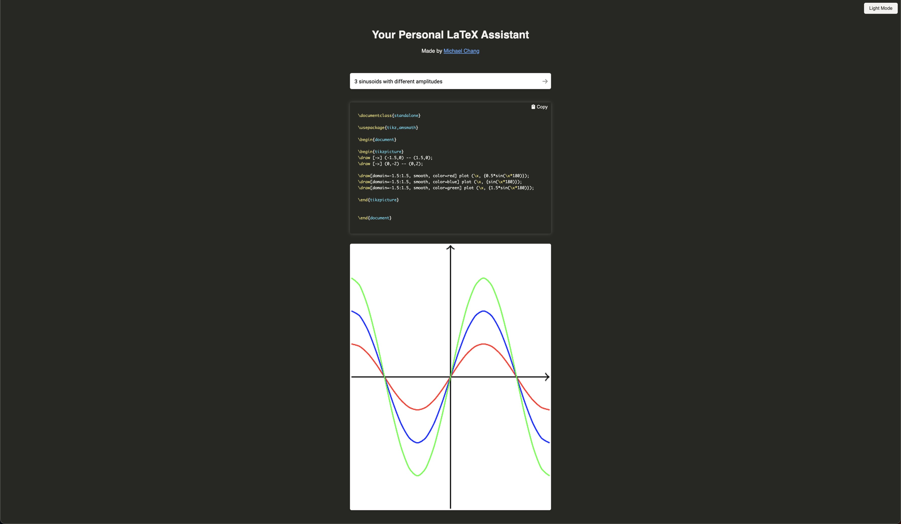

# Your Personal LaTeX Assistant



This is based on the OpenAI Quickstart Tutorial [quickstart tutorial](https://beta.openai.com/docs/quickstart). It uses the [Flask](https://flask.palletsprojects.com/en/2.0.x/) web framework. Follow the instructions below to get set up.

## Setup

1. If you don’t have Python installed, [install it from here](https://www.python.org/downloads/).

2. Install `pdflatex`. You can [install it from here](https://www.latex-project.org/get/). 

3. Install ImageMagick. You can [install it from here](https://imagemagick.org/script/download.php).

3. Clone this repository.

4. Navigate into the project directory:

   ```bash
   $ cd latex-assistant
   ```

5. Create a new virtual environment:

   ```bash
   $ python -m venv venv
   $ . venv/bin/activate
   ```

6. Install the requirements:

   ```bash
   $ pip install -r requirements.txt
   ```

7. Make a copy of the example environment variables file:

   ```bash
   $ cp .env.example .env
   ```

8. Add your [API key](https://beta.openai.com/account/api-keys) to the newly created `.env` file.

9. Run the app:

   ```bash
   $ flask run
   ```

You should now be able to access the app at [http://localhost:5000](http://localhost:5000)! For the full context behind this example app, check out the [tutorial](https://beta.openai.com/docs/quickstart).
